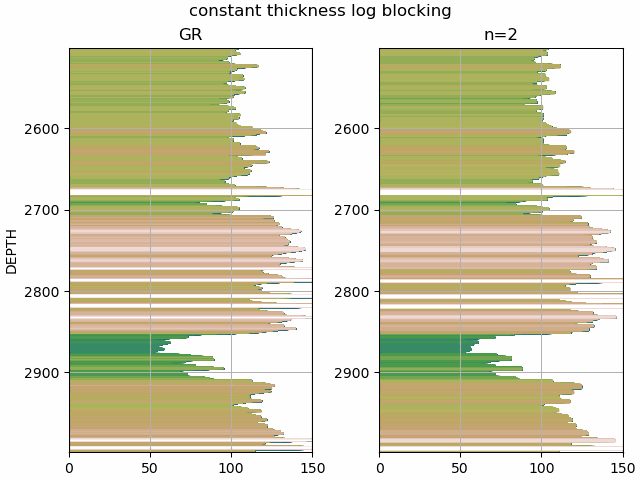

# ANOVA Well Log Blocking

Blocking well log curve data is a method of upscaling high resolution petrophysical data (relative to conventional seismic acquisition data) to a lower resolution by intelligently blocking zones of geologic packages. Each geologic package is expected have similar properties and the objective is to remove small variations within the package and replace with a single value producing a "blocked" curve.

For this example, a well from the [Teapot](https://wiki.seg.org/wiki/Teapot_dome_3D_survey) open source dataset has been used. Information from the LAS file is given below.

```
    Mnemonic  Unit  Value                       Description             
    --------  ----  -----                       -----------             
    STRT      F     4332.0                      START DEPTH             
    STOP      F     449.0                       STOP DEPTH              
    STEP      F     -1.0                        STEP                    
    NULL            -999.25                     NULL VALUE              
    COMP            DEPARTMENT OF ENERGY        COMPANY                 
    WELL            48X-28                      WELL                    
    FLD             NAVAL PETROLEUM RESERVE #3  FIELD                   
    LOC             490' FSL, 2449' FWL         LOCATION                
    CNTY            NATRONA                     COUNTY                  
    STAT            WYOMING                     STATE                   
    CTRY                                        COUNTRY                 
    API             49-025-23195                API NUMBER              
    UWI                                         UNIQUE WELL ID          
    DATE            15-Mar-2004                 LOG DATE {DD-MMM-YYYY}  
    SRVC            Schlumberger                SERVICE COMPANY        
    LATI      DEG                               LATITUDE                
    LONG      DEG                               LONGITUDE               
    GDAT                                        GeoDetic Datum          
    SECT            28                          Section                 
    RANG            78W                         Range                   
    TOWN            39N                         Township                

    Mnemonic  Unit  Value          Description                                                  
    --------  ----  -----          -----------                                                  
    RUN             1              RUN NUMBER                                                   
    PDAT            GROUND LEVEL   Permanent Datum                                              
    EPD:1     F     5105.0         Elevation of Permanent Datum above Mean Sea Level            
    EPD:2     F     5105.0         Elevation of tool zero above Mean Sea Level                  
    LMF             KELLY BUSHING  Logging Measured From (Name of Logging Elevation Reference)  
    APD                            Elevation of Depth Reference (LMF) above Permanent Datum     
```

These examples use the Gamma Ray curve, but any curve could be used.

The simplest method of log blocking is to use a constant thickness. This method replaces each window of constant thickness, or constant number of samples in this case, with the median value in that window.

A more robust approach is to use the analysis of variance statistical method to determine the index at which two zones within a region are statistically different. Al-Adani (2012) provides a basic summary: 

    1. Select a zone break point to divide into two new zones. Each zone should include at least two sample data.
    2. Calculate the *mean variance within zones (MVWZ)* and *mean variance among zones (MVAZ)*
    3. Compute the *ratio of variances (R)*

The mean variance within zones is defined as:

$$ MVWZ = \frac{\sum_{i}^{n_1}\left ( X_i-\overline{X_1} \right )^{2}+\sum_{i}^{n_2}\left ( X_i-\overline{X_2} \right )^{2}}{n_1+n_2-2} $$

The mean variance among zones is defined as:

$$ MVAZ = n_1\left ( \overline{X_1}-\overline{X} \right )^{2}+n_2\left ( \overline{X_2}-\overline{X} \right )^{2} $$

To determine the breakpoint, all possible "splits" or division into two zones are tested. The breakpoint is the index with the largest ratio of variances, defined as:

$$ R = 1 - \frac{MVWZ}{MVAZ} $$

**HERE IS SOMETHING DIFFERENT**
In reading through the procedure, particularly the first step *Select a zone break point to divide into two new zones*, one may postulate the best data structure for this is a binary tree. The implementation here recursively builds a binary tree (using the third party library and open source project [binarytree](https://binarytree.readthedocs.io/en/main/index.html)) where the leaf nodes are the breakpoints in order from left to right. This is illustrated in the notebook [example_tree.ipynb](./example_tree.ipynb).

Once all the breakpoints are determined, each zone can be "blocked" using the median or mean value within the zone. The result is a "blocked" or "zoned" well curve. An example is given in the notebook [example_anova.ipynb](./example_anova.ipynb)



### References
- Al-Adani, Nabil, 2012, Data Blocking or Zoning: Well-Log-Data Application: Journal of Canadian Petroleum Technology.
