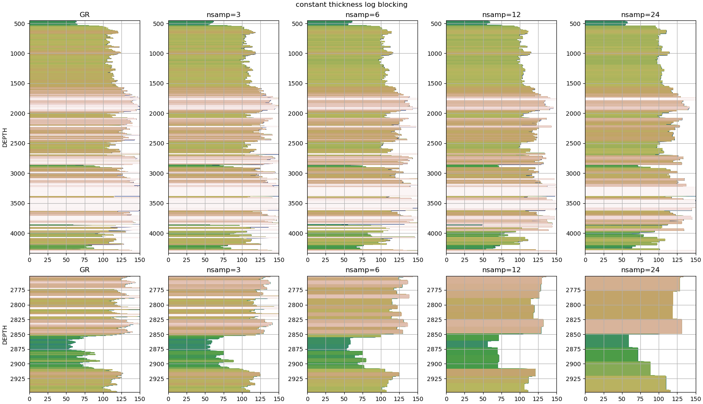
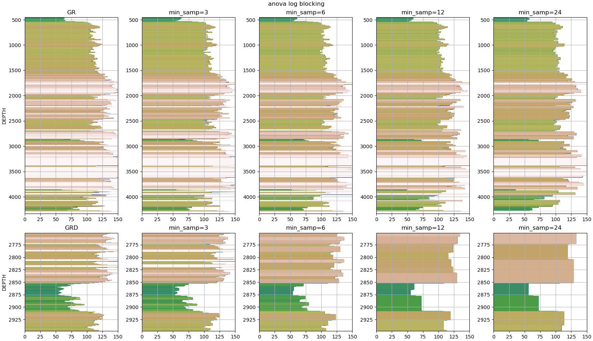

=======================
ANOVA WELL LOG BLOCKING
=======================

Blocking well log curve data is a method of upscaling high resolution petrophysical data (relative to conventional seismic acquisition data) to a lower resolution...

Importing Well Data
-------------------
The first step is to read the well data and extract the curve information. This example uses the library `lasio`_ for this purpose.

.. _lasio: https://lasio.readthedocs.io/en/latest/index.html

.. code-block:: python

    import lasio
    las_obj = lasio.read("data/us49025106110000_0_00028h489546.las")
    print(las_obj.well)

.. code-block::

    Mnemonic  Unit  Value                                Description      
    --------  ----  -----                                -----------      
    STRT      F     32.0                                 START DEPTH      
    STOP      F     1082.0                               STOP DEPTH       
    STEP      F     0.5                                  STEP LENGTH      
    NULL            -999.25                              NO VALUE         
    COMP            FENIX & SCISSON INC                  COMPANY          
    WELL            NAVAL PETROLEUM RESERVE 3 SX #55-14  WELL             
    FLD             TEAPOT DOME                          FIELD            
    LOC             S14 T38N R78W                        LOCATION         
    CNTY            NATRONA                              COUNTY           
    STAT            WYOMING                              STATE            
    CTRY            UNITED STATES OF AMERICA             COUNTRY          
    SRVC            Unknown                              SERVICE COMPANY  
    DATE            22-APR-1978                          LOGDATE          
    API             490251061100                         API NUMBER

.. code-block:: python

    print(las_obj.curves)

.. code-block:: 

    Mnemonic  Unit  Value         Description                      
    --------  ----  -----         -----------                      
    DEPT      F                                                    
    SPR       MV    05 010 01 00  SPONTANEOUS POTENTIAL FROM RES.  
    ILD       OHMM  05 120 46 00  INDUCTION LOG DEEP               
    SN        OHMM  05 040 16 00  SHORT NORMAL 16"                 
    GRD       GAPI  45 310 01 00  GAMMA RAY FROM DENSITY LOG       
    CALD      IN    45 280 60 00  CALIPER                          
    DPOR      DEC   45 890 12 00  DENSITY POROSITY SANDSTONE       
    RHOB      G/C3  45 350 01 00  BULK DENSITY                     
    CORR      G/C3  45 356 01 00  DENSITY CORRECTION

Nearly all well logging measurement data have missing values. For the purposes of these examples, the `pandas.DataFrame.fillna`_ method is used. The functions provided here are simple and assume all missing has been removed or filled in and there are no nan's in the curves.

.. _pandas.DataFrame.fillna: https://pandas.pydata.org/pandas-docs/stable/reference/api/pandas.DataFrame.fillna.html

.. code-block:: python

    df = las_obj.df()
    df['DEPTH'] = df.index
    df = df.fillna(method="ffill")
    df = df.fillna(method="bfill")

These examples use the Gamma Ray curve, but any curve could be used.

.. code-block:: python

    depth = df.index.to_numpy()
    curve = df['GRD'].to_numpy()

Constant Thickness
------------------

The simplest method of log blocking is to use a constant thickness. This method replaces each window of constant thickness, or constant number of samples in this case, with the median value in that window.

.. code-block:: python

    def constant_thickness_zoning(input_array:numpy.ndarray, nsamples:int):
        output_array = numpy.zeros_like(input_array)

        for n in range(0,len(input_array),nsamples):
            output_array[n:n+nsamples] = numpy.median(input_array[n:n+nsamples])
        # handle the last samples
        if n+nsamples < len(input_array):
            output_array[n+nsamples:] = numpy.median(input_array[n+nsamples:])
    return output_array

For example, window lengths of 5, 10, 15, and 20 are shown below:

Analysis of Variance
--------------------
A more robust approach is to use the analysis of variance statistical method to determine the index at which two zones within a region are statistically different. Al-Adani (2012) provides a basic summary: 

    1. Select a zone break point to divide into two new zones. Each zone should include at least two sample data.
    2. Calculate the *mean variance within zones (MVWZ)* and *mean variance among zones (MVAZ)*
    3. Compute the *ratio of variances (R)*

The mean variance within zones is defined as:

.. math:: 

    MVWZ = \frac{\sum_{i}^{n_1}\left ( X_i-\overline{X_1} \right )^{2}+\sum_{i}^{n_2}\left ( X_i-\overline{X_2} \right )^{2}}{n_1+n_2-2}
    :label: mean variance within zones

and written in python as a function

.. code-block:: python

    def _mean_variance_within_zone(zone1:numpy.ndarray, zone2:numpy.ndarray):
    m1 = numpy.mean(zone1)
    m2 = numpy.mean(zone2)
    n1 = len(zone1)
    n2 = len(zone2)
    a = numpy.sum(numpy.square(zone1 - m1))
    b = numpy.sum(numpy.square(zone2 - m2))
    return (a + b) / (n1 + n2 - 2)

The mean variance among zones is defined as:

.. math:: 

    MVAZ = n_1\left ( \overline{X_1}-\overline{X} \right )^{2}+n_2\left ( \overline{X_2}-\overline{X} \right )^{2}
    :label: mean variance among zones

and written in python as a function

.. code-block::python

    def _mean_variance_among_zones(zone1:numpy.ndarray, zone2:numpy.ndarray):
        m1 = numpy.mean(zone1)
        m2 = numpy.mean(zone2)
        n1 = len(zone1)
        n2 = len(zone2)
        m0 = (numpy.sum(zone1) + numpy.sum(zone2)) / (n1 + n2)  # overall average
        return n1 * (numpy.square(m1-m0)) + n2 * (numpy.square(m2-m0))

To determine the breakpoint, all possible "splits" or division into two zones are tested. The breakpoint is the index with the largest ratio of variances, defined as:

.. math:: 

    R = 1 - \frac{MVWZ}{MVAZ}
    :label: ratio of variances

The python function below allows for an additional paramter to be set which defines the minimum number of samples in window or zone, i.e. no zones should be smaller than this parameter.

.. code-block:: python

    def _anova_breakpoint(arr:numpy.ndarray, min_samples_in_zone:int):
        """determine the optimal breakpoint, i.e. the index with the largest ratio of variances.
        """
        if len(arr) < 2*min_samples_in_zone:
            kbest = None
        else:
            kbest = min_samples_in_zone  
            rbest = 0
            for k in range(min_samples_in_zone,len(arr)-min_samples_in_zone):
                z1 = arr[:k]
                z2 = arr[k:]
                if _mean_variance_among_zones(zone1=z1, zone2=z2) != 0.0:
                    ratio_of_variances = 1 - (_mean_variance_within_zone(zone1=z1, zone2=z2) / _mean_variance_among_zones(zone1=z1, zone2=z2))
                    if ratio_of_variances > rbest:
                        rbest = ratio_of_variances
                        kbest = k
        return kbest

**HERE IS SOMETHING DIFFERENT**
In reading through the procedure, particularly the first step *Select a zone break point to divide into two new zones*, one may postulate the best data structure for this is a binary tree. The implementation here recursively builds a binary tree (using the third party library and open source project `binarytree`_) where the leaf nodes are the breakpoints in order from left to right. 

.. _binarytree: https://binarytree.readthedocs.io/en/main/index.html
    
implemented in python

.. code-block:: python

    def _anova_recursive_tree_build(node:binarytree.Node, a:numpy.ndarray, min_samples_in_zone:int):
        """anova
        recursive tree building
        """
        knot = node.value  # parent node value
        k = _anova_breakpoint(arr=a, min_samples_in_zone=min_samples_in_zone)
        if k:
            node.left = _anova_recursive_tree_build(node=binarytree.Node(value=knot), a=a[:k], min_samples_in_zone=min_samples_in_zone)
            node.right = _anova_recursive_tree_build(node=binarytree.Node(value=k+knot), a=a[k:], min_samples_in_zone=min_samples_in_zone)
        return node

Finally, applying the anova zonation in a function

.. code-block:: python

    def anova_zoning(input_array:numpy.ndarray, min_samples_in_zone=2):
        """anova zoning
        """
        output_array = numpy.zeros_like(input_array)

        root = _anova_recursive_tree_build(node=binarytree.Node(value=0), a=input_array, min_samples_in_zone=min_samples_in_zone)
        breakpoints = []
        for leaf in root.postorder:
            if not leaf.left and not leaf.right:
                breakpoints.append(leaf.value)
        breakpoints.append(len(input_array))
        for n in range(len(breakpoints)-1):
            wstart = breakpoints[n]
            wend = breakpoints[n+1]
            output_array[wstart:wend] = numpy.median(a=input_array[wstart:wend])
        return output_array

Using the same curve as the constant thickness log blocking example above, one can see that the blocked zones using the analysis of variance statistic are more closely representative of geologic packages.

References
----------
- Al-Adani, Nabil, 2012, Data Blockign or Zoning: Well-Log-Data Application: Journal of Canadian Petroleum Technology.

Data
----
The well log provided (./data/us49025106110000_0_00028h489546.las) is part of the open source project `Teapot Dome`_.
.. _Teapot Dome: https://wiki.seg.org/wiki/Teapot_dome_3D_survey